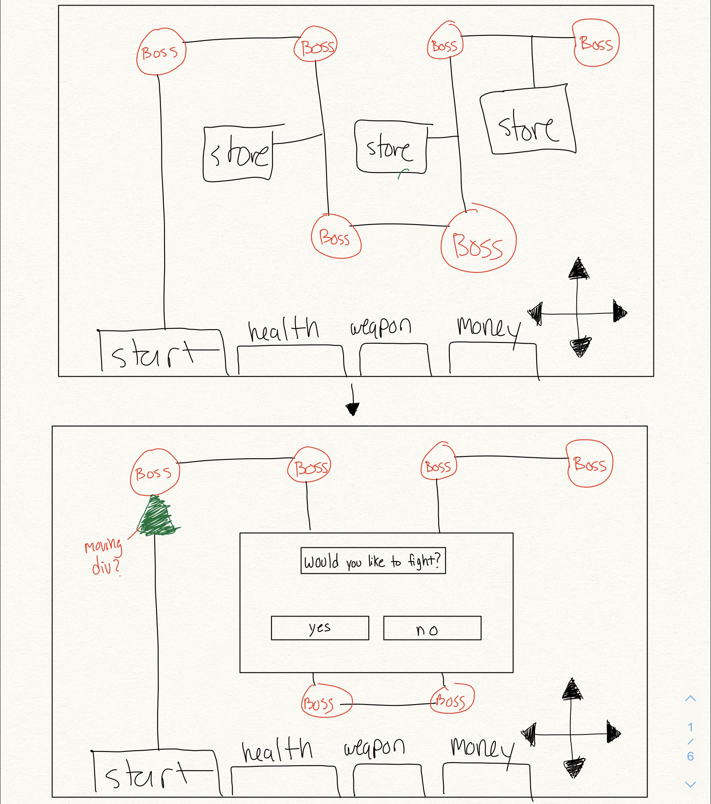
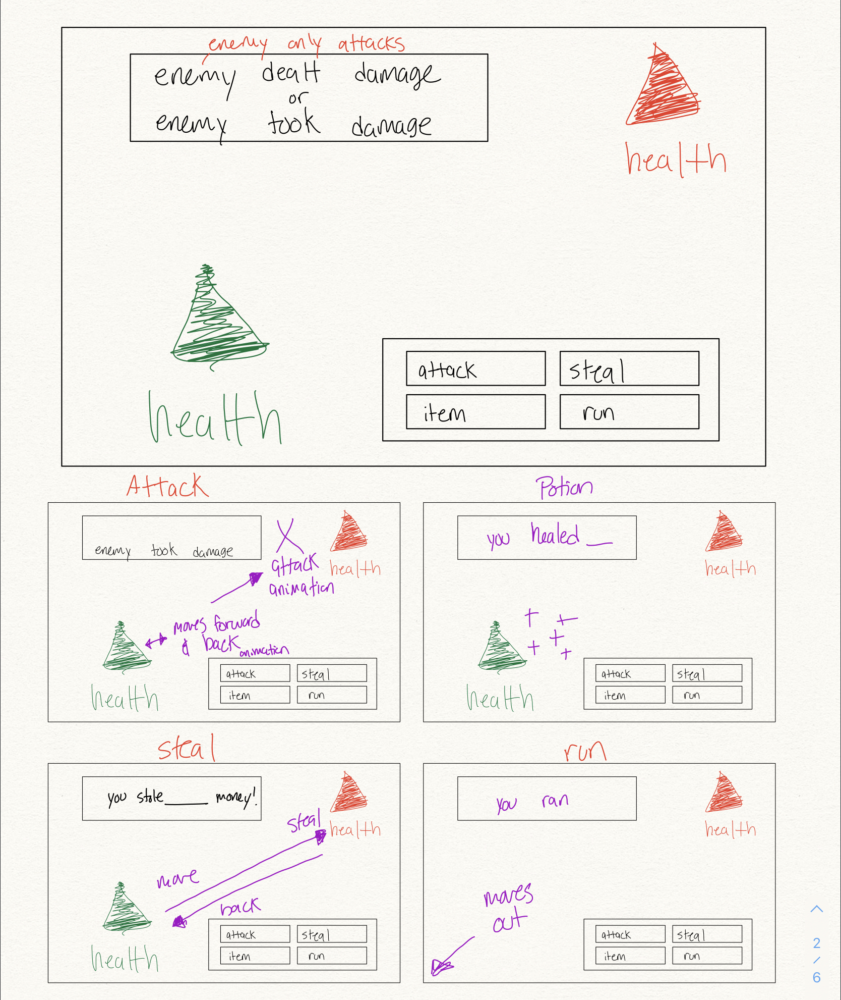
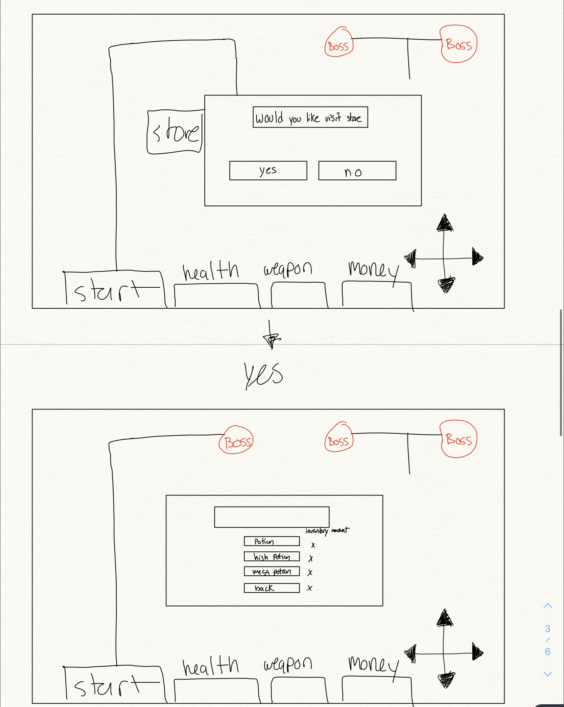

- Final Fantasy Adventure Game

- What is Final Fantasy Adventure?
    - A turn based adventure RPG 
    - User must find monsters on the map and beat them until they are able to fight the final monster
    - User wins money every battle they win
    - User is also able to find shops in the map to purchase potions and weapons 

- Technologies Used 
    - HTML, CSS, Vanilla Javascript

- Approach 
    - There are 4 screens that the player can access, start menu, map, shop, and battle screens
    - The user can only access the screens one at a time, accessing one screen will trigger the other screens to display none (DOM Manipulation)
    In the battle the options will also trigger more DOM manipulation based on the users actions (hiding menus, activating animations)
    - Each monster, menu displays, and menu buttons all have event listeners to either change the screen, perform a function/animation, or update user stats and inventory.

- Instructions
    - The player is welcomed with a start screen on load
    - If player chooses to start the game they are brought to the map where they can walk around and 
    click either a monster, the shop, or their inventory
    - The screen will change based on these actions, fighting a monster will trigger a battle screen with that specific monster allowing the user to fight that monster (with unique stats) 
        - after winning or losing a fight the player is brought back to the main screen and can move onto the next monster or choose to go to the shop (their health does not regenerate after the fight automatically)
    - When the player goes to the shop, the screen switches to the shop screen and is allowed to buy potions or weapons (menu will update based on inventory)
        - they can access these items by clicking the inventory button which changes to that screen and allows the user to use potions and see their stats in real time
    - The player can then move onto the next monster until they beat the final boss (
        there is a specific order that the player must fight the monsters, if they go out of order the battle function does not trigger and an alert tells the player they cannot fight that monster yet)
    - Once the player beats the final monster they are greeted with a win anouncement and the game is reloaded

- Wireframes

- User Stories
    - the game was really fun to make, it was incredible creating something from nothing and having full control of all the features I wanted to implement!
    - Dexter was an awesome help in both support and keeping my spirits up
    - Running into walls, bugs, and glitches was frustrating, but definitely tested my problem solving skills and helped my growth on how to tackle problems 
    
- Unsolved Problems
    - Initially I wanted the screen to return back to the map automatically after beating a monster however once a monster was beaten and the screen switches automatically, it would trigger again once the next battle is triggered. I had the switchToScreen function dependent upon beating the first monster but since that condition was now true after beating them it kept triggering in the next sequence